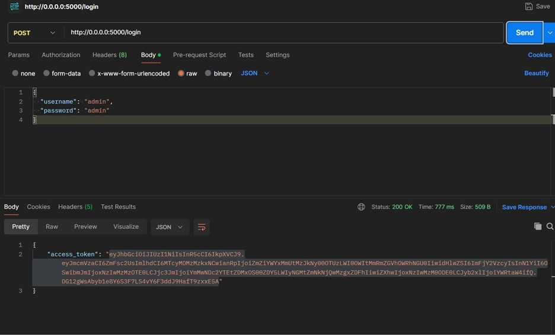
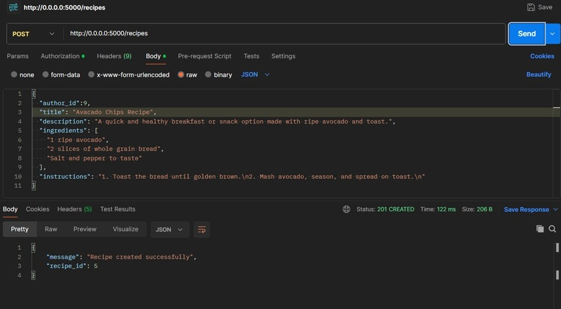
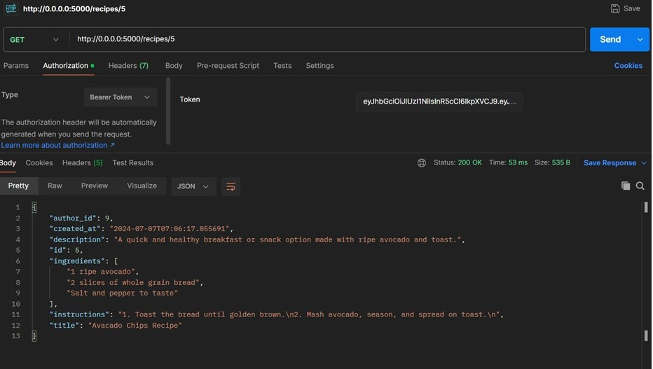
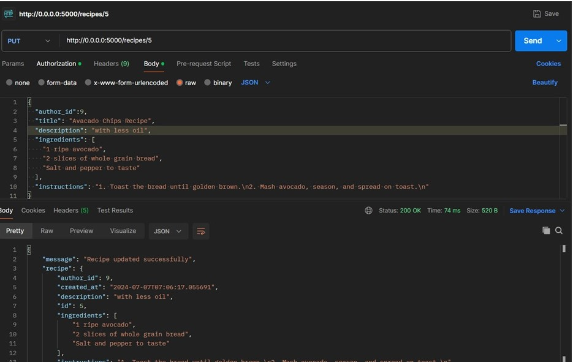
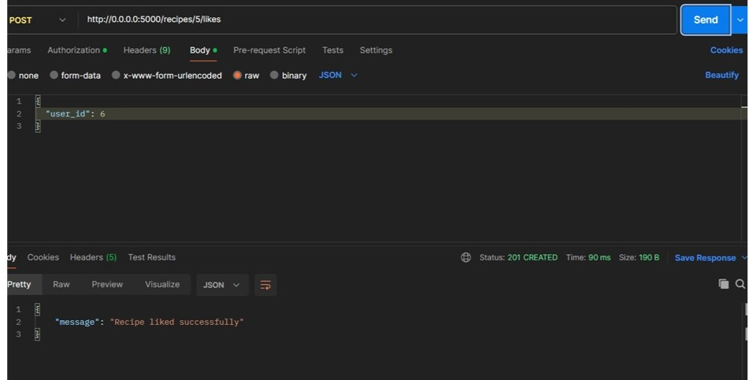
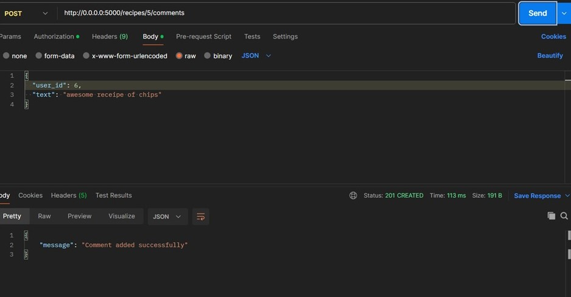

# Recipe Sharing Platform
## Features
* User Authentication: Secure user registration and authentication using JWT.
* Recipe Management: CRUD operations for recipes including create, read, update, and delete.
* Comments and Likes: Users can comment on recipes and like them.
* Role-Based Access Control: Different roles like admin and contributor with specific permissions.
* Pagination: Displaying recipes and comments in paginated format.
* Database: PostgreSQL database backend for storing recipes, comments, likes, and user data.

## Technologies Used
* Backend: Python, Flask
* Web Server: Gunicorn 
* Database: PostgreSQL
* ORM: SQLAlchemy
* API Documentation: OpenAPI (Swagger)
* Authentication: Flask JWT Extended
* Containerization: Docker
* Testing: Unit testing with unittest framework
## Screenshots
* Login:

  
* Recipe Create

  

* Recipe GET

  

* Recipe Update

  

* Recipe Like

  

* Recipe Comment

  

## Developed By
 - Onkar Chavan
 - omchavan6699@gmail.com

